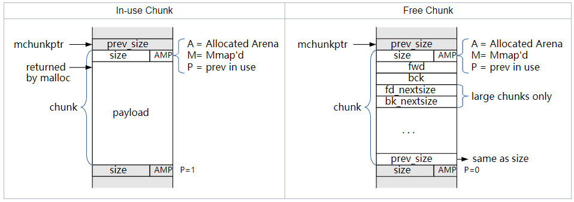
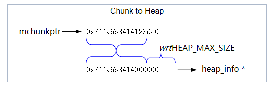
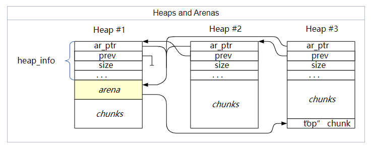
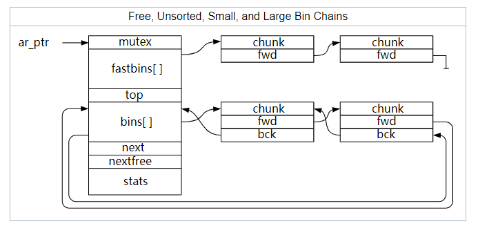
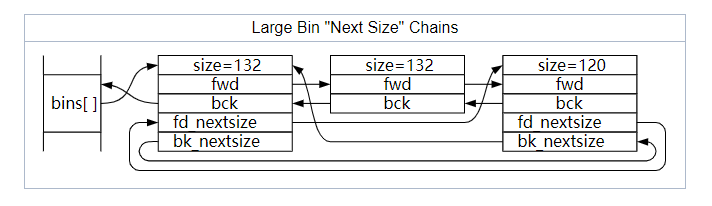
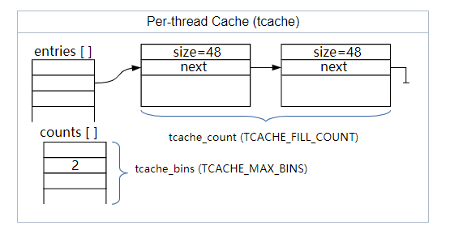

# MallocInternals

## Overview of Malloc

GNU C库（glibc）的 malloc 库包含了一些管理应用程序地址空间中分配的内存的函数。glibc 的 malloc 是由 ptmalloc（pthreads malloc）派生出来的，而 pthreads malloc 是由 dlmalloc（Doug Lea malloc）派生出来的。这个 malloc 是一个 "heap" 风格的 malloc，这意味着不同大小的`chunk`存在于一个更大的内存区域（a "heap"）中，而不是像其他的实现那样，使用位图和数组，或者相同大小的块的区域等。在很久之前，每个应用程序一个堆，但 glibc 的 malloc 允许多个堆，每个堆都在其地址空间内增长。

在本文档中，我们会提及一些常用术语：

**Arena**

一个结构，能在一个或多个线程之间共享，它包含对一个或多个堆的引用，以及这些堆中 "free" 的块的链表。被分配到每个`arena`的线程将从该`arena`的空闲列表中分配内存。

**Heap**

一个连续的内存区域，被细分为要分配的`chunk`。每个堆正好属于一个`arena`。

**Chunk**

一个小范围的内存，可以被分配（由应用程序拥有），释放（由glibc拥有），或与相邻的`chunk`组合成更大的范围。请注意，一个`chunk`是给应用程序的内存块的一个包装。每个`chunk`都存在于一个`heap`中，属于一个`arena`。

**Memory**

应用程序地址空间的一部分，通常由 RAM 或 swap 来支持。

Note that, in this document, we only refer to "memory" as a generic term. While there is some code in glibc's malloc to work with the Linux kernel (or other OS) to hint at what memory should be mapped/backed and what can be returned to the kernel, such discrimination between "real memory" and "virtual memory" is irrelevant to the discussion herein, unless explicitly called out.

注意，在本文中，我们只把 "memory" 作为一个通用术语。虽然在 glibc 的 malloc 中有一些代码与 Linux 内核（或其他操作系统）合作，提示哪些内存应该被映射/备份，哪些可以返回给内核，但这种对 "real memory" 和 "virtual memory" 的区分与本文的讨论无关，除非被明确指出。

## What is a Chunk?

Glibc 的 malloc 是面向`chunk`的。它将一个大的内存区域（a "heap"）分成不同大小的`chunk`。每个`chunk`包含关于自身大小的元数据（通过`chunk`头中的 size 字段），从而得出相邻的块在哪里。当一个`chunk`被应用程序使用时，唯一被“记住”的数据是该`chunk`的大小。当该`chunk`被释放时，之前用于应用程序数据的内存被重新用于另外的`arena`相关信息，如链表中的指针，这样就可以快速找到合适的`chunk`并在需要时再次使用。另外，被释放的`chunk`中的最后一个字包含该块的大小的拷贝（其中三个LSB被设置为零，而块前面的三个LSB则是用于标志的大小）。

在malloc库中，"chunk pointer" 或 mchunkptr 并不指向`chunk`的开始，而是指向前一个`chunk`中的最后一个字--也就是说，除非你知道前一个`chunk`是空闲的，否则 mchunkptr 中的第一个字段是无效的。

所有的`chunk`都是8的倍数，`chunk`中 size 字段的3个LSB可以用来做为标志位。三个标志位定义如下：

**A(0x04)**

已分配的`arena` -  main arena 使用应用程序的堆，其他`arena`使用`mmap`分配的堆，要把一个`chunk`映射到一个堆，我们需要知道什么场景适用，如果这个位为0，则该`chunk`属于 main arena  和主堆。如果这个位为1，则该`chunk`属于`mmap`分配的内存，堆的位置可以通过`chunk`的地址计算出来。

**M(0x02)**

`mmap`分配的`chunk` - 这个`chunk`是通过调用`mmap`分配的，不属于堆的一部分。

**P(0x01)**

前一个`chunk`正在使用 - 如果这个位被设置，则说明前一个`chunk`正在被应用程序使用，因此 prev_size 字段无效。注意，一些`chunk`，比如 fastbins（见下文）中的`chunk`，尽管被应用程序释放，这个位仍会被设置。这个位真正含义是前一个`chunk`不应该被当做下一次分配内存时的候选 - 它正被其应用程序或 malloc 源码层一些优化使用。

为了确保一个`chunk`的 payload 域足够大，以满足 malloc 所需的开销，一个`chunk`的最小大小是 4\*sizeof(void\*)（除非 size_t 与 void\* 的尺寸不同）。如果平台的 ABI 要求额外的对齐方式，最小大小值可能会更大。请注意，prev_size 不会将最小`chunk`的大小增加到 5\*sizeof(void\*)，因为当`chunk`很小的时候，bk_nextsize 指针是未使用的，当`chunk`足够大到可以使用它的时候，这时`chunk`尾部也有足够的空间了。



注意，由于`chunk`在内存中是相邻的，如果你知道堆中第一个`chunk`的地址（最低地址），你可以通过 size 来遍历堆中的所有块，但只能通过增加地址来实现，尽管可能很难判断出什么时候遍历到最后一个`chunk`。

已分配的堆总是以2的次方来地址对齐。因此，当一个`chunk`在分配的堆中时（即A位被设置），该堆的 heap_info 的地址可以根据该`chunk`的地址来计算：



## Arenas and Heaps

为了有效地处理多线程应用程序，glibc 的 malloc 允许在同一时间激活多个内存区域。因此，不同的线程可以访问不同的内存区域而互不干扰。这些内存区域被统称为 "arenas"。有一个 "main arena"，它与应用程序的初始堆相对应。在malloc代码中，有一个静态变量指向这个`arena`，每个`arena`都有一个 next 指针来连接其他`arena`。

随着线程碰撞压力的增加，额外的`arena`会通过`mmap`创建来缓解压力。`arena`的数量上限是系统中  CPU 数量的8倍（除非用户自定义，见 "mallopt"），这意味着一个大量线程的应用程序仍然会存在一些竞争，但权衡之下，碎片会更少。

每个`arena`结构中都有一个 mutex，用来控制对该`arena`的访问。请注意，一些操作，例如对`fastbin`的访问，可以用原子操作完成，不需要锁定`arena`。其他的所有操作都需要线程在`arena`上加一个锁。对这个 mutex 的竞争是创建多个`arena`的原因—分配到不同`arena`的线程不需要互相等待。如果需要竞争，线程会自动切换到未使用的（未锁定的）`arena`。

每个`arena`从一个或多个堆中获取内存，main arena 使用程序的初始堆（从 .bss 等之后开始）。额外的`arena`通过`mmap`为它们的堆分配内存，当旧的堆被用完时，将更多的堆添加到它们的堆的列表中。每个`arena`都会跟踪一个特殊的 "top" `chunk`，这通常是最大的可用`chunk`，也是指最近分配的堆。

分配给`arena`的内存可以很方便的从该`arena`的初始堆中获取：



在每个`arena`，`chunk`要么被应用程序使用要么空闲。`arena`不会跟踪正在使用的`chunk`，空闲的`chunk`根据不同的大小和**历史**保存在不同的链表中。因此**库**能快速找到合适的`chunk`来满足分配请求。这些链表称作 "bins"：

**Fast**

较小的`chunk`保存在特定大小的 bin 中。添加到 fast bin 中`chunk`不会与相邻的`chunk`结合在一起—**这个逻辑能保证快速访问**（因此得名 fastbin），fastbin 中的`chunk`可以根据需要被移动到其他 bins 中。fastbin 中的`chunk`被保存在一个单链表中，因为它们大小一致并且链表中间的`chunk`永远不需要被访问。

**Unsorted**

当`chunk`被释放时，最初被存在一个单一的 bin 中，它们稍后在malloc中被分类，以便给他们一个快速再重新使用的机会，这也意味着分类逻辑只需要存在于一个点上—其他人只需将释放的`chunk`放入这个 bin，这些`chunk`稍后便会被分类。

**Small**

正常的 bins 被分为 "small" bins 和 "large" bins，small bins中的`chunk`大小一致，lagre bins 中的`chunk`大小都有一定的范围。当`chunk`被添加到这些 bin 中时，首先会与它相邻的`chunk`合并成更大的`chunk`，因此这些`chunk`永远不会与其他这类`chunk`相邻（尽管它们可能与 fast bin 和 unsorted bin 以及正在使用中的`chunk`相邻）。small chunks 和 lagre chunks 都是双向链表以便`chunk`可以从中间删除（比如，当它们与新释放的`chunk`结合时）。

**Large**

如果一个`chunk`所在 bin 可以包括不同大小的`chunk`，那么该`chunk`就是 "large"。对于 small bins，你可以选择第一个`chunk`并直接使用。对于 large bins，必须找到 "best" chunk，并可能将其分割成两个`chunk`（一个是你需要的大小，一个是剩余的大小）。



注意：在上图和下图中，所有的指针都指向`chunk`（mchunkptr）。由于 bins 不是 chunks（它们是 fwd/bck 指针的数组）， 一个被用来提供一个 mchunkptr 到一个类似`chunk`的对象的 hack方法，它与 bin "恰好 "重叠，这样 mchunkptr 的 fwd 和 bck 字段就可以用来访问合适的 bin。

对于 large chunks 需要找到最合适的 chunk。large chunks 有一个额外的双向链表，用来连接链表中每种大小的第一个`chunk`，并且按`chunk`大小排序，从大到小。这使得 malloc 能够快速扫描出第一个足够大的`chunk`。注意：如果存在多个给定大小的`chunk`，第二个`chunk`通常是被选中的，这样就不需要调整 next-size 的链表。出于同样的原因，插入到链表中的`chunk`被添加到相同大小的`chunk`之后。



## Thread Local Cache (tcache)

While this malloc is aware of multiple threads, that's pretty much the extent of its awareness - it knows there are multiple threads. There is no code in this malloc to optimize it for NUMA architectures, coordinate thread locality, sort threads by core, etc. It is assumed that the kernel will handle those issues sufficiently well.

虽然这个malloc知道有多个线程，但这几乎是它的意识范围--它知道有多个线程。这个malloc中没有任何代码可以针对NUMA架构进行优化，协调线程位置，按核对线程进行分类，等等。我们假设内核会很好地处理这些问题。

每个线程都有一个 thread-local 变量，记录它最后使用的`arena`。如果该`arena`正在使用，当一个线程需要使用该`arena`时，那么该线程将阻塞以等待该`arena`被释放。如果该线程之前前从未使用过`arena`，那么它可能会尝试重新使用一个未使用的`arena`，创建一个新的，或者在全局链表中选择下一个。

Each thread has a per-thread cache (called the *tcache*) containing a small collection of chunks which can be accessed without needing to lock an arena. These chunks are stored as an array of singly-linked lists, like fastbins, but with links pointing to the payload (user area) not the chunk header. Each bin contains one size chunk, so the array is indexed (indirectly) by chunk size. Unlike fastbins, the tcache is limited in how many chunks are allowed in each bin (`tcache_count`). If the tcache bin is empty for a given requested size, the next larger sized chunk is not used (could cause internal fragmentation), instead the fallback is to use the normal malloc routines i.e. locking the thread's arena and working from there.

每个线程都有一个本地缓存（称为 *tcache*），其中包含一个小型的`chunk`集合，可以在不需要锁定`arena`的情况下进行访问。这些`chunk`被存储为一个单链表数组，就像 fastbins 一样，但指针指向 payload（user area）而不是`chunk`头。每个 bin 包含一类大小的chunk，所以这个数组是按`chunk`大小来索引的（间接地）。与 fastbins 不同，tcache 限制了在每个 bin 中允许有多少个chunk（`tcache_count`）。**如果 tcache bin 在给定请求大小的情况下是空的**，则不会使用下一个更大的`chunk`（可能会导致内部碎片），相反，退而求其次，使用正常的 malloc 例程，即锁定线程的`arena`并从那里开始工作。



## Malloc Algorithm

简而言之，malloc工作原理如下：

- 如果 tcache 有合适（仅完全匹配）的`chunk`，则返回该`chunk`给调用方。不会尝试使用更大尺寸的 bin 中的可用`chunk`。

- 如果请求的内存足够大，则使用`mmap()`直接向操作系统申请内存。注意，`mmap`的阈值是动态的，除非被 M_MMAP_THRESHOLD 覆盖（参见 mallopt() 文档），and there may be a limit to how many such mappings there can be at one time
- 如果相应的 fastbin 中存在`chunk`，则使用该`chunk`，额外的可用`chunk`可以先填充到 tcache。
- 如果相应的 smallbin 中存在chunk，则使用该`chunk`，同时可能也会在这里预先填充 tcache。
- 如果请求是 "large" 的，会花些时间把 fastbin 里的所有内容都移到 unsorted bin 中，边移动边合并。
- 开始从 unsorted list 中取出`chunk`，并将它们移动到 small/large bin 中，边移动边合并（注意，这是代码中唯一将`chunks`放入 small/large bin 的地方）。如找到一个大小合适的`chunk`，就使用这个`chunk`。
- 如果请求是 "large" 的，则搜索相应的 large bin，以及逐渐增大的 large bin，直到找到一个足够大的`chunk`。
- 如果在 fastbins 中仍存在`chunk`（这可能发生在 "small" 请求中），合并这些`chunk`并重复前两个步骤。
- 分离出 "top" 的一部分，可能事先扩大 "top" 的范围????。Split off part of the "top" chunk, possibly enlarging "top" beforehand.

对于 over-aligned 的 malloc，如 valloc、pvalloc 或 memalign，一个过大的`chunk`被定位（使用上面的malloc算法）并分成两个或更多的块，这样的方式使得大部分的`chunk`现在被适当的对齐（并返回给调用者），而该部分前后的多余部分被返回到 unsorted list 中，以便以后再使用。

## Free Algorithm 

注意，一般来说，“释放”内存实际上并没有把它返回给操作系统供其他应用使用。`free()`调用标记一块内存为空闲的将被应用程序使用的，但是从操作系统角度来看，该内存仍然属于应用程序。然而，如果堆中的顶部`chunk`--与未映射的内存相邻的部分--变得足够大，其中一些内存可能会被取消映射并返回给操作系统。                                                                                                                                                                                                                             

简而言之，free 工作原理如下：

- 如果是 tcache 中有空间，则保存该`chunk`至 tcache 中并返回。
- 如果`chunk`足够小，就放在合适的 fastbin 中。

- 如果`chunk`是 mmap 的，则 munmap 掉。
- If the chunk was mmap'd, munmap it.
- 如果这个`chunk`和其他空闲`chunk`相邻，就进行合并。
- 将该块放在 unsorted 的列表中，除非它现在是 "top" 的`chunk`。
- 如果该`chunk`足够大，就合并任何 fastbins，看看顶部的`chunk`是否足够大，以便将一些内存还给系统。请注意，出于性能的考虑，这一步可能会被推迟，在malloc或其他调用中发生。
- If the chunk is large enough, coalesce any fastbins and see if the top chunk is large enough to give some memory back to the system. Note that this step might be deferred, for performance reasons, and happen during a malloc or other call.

## Realloc Algorithm

```c
void *realloc( void *ptr, size_t new_size );
```

请注意，对于参数 ptr 为 NULL 和 new_size 为0 是区分处理的，并按照相关的规范。

简而言之，realloc 工作原理如下:

*对于 MMAP'd chunks......*

通过 mmap 调用来分配，通过 mremap() 重新分配（如果支持的话）。这样可能会或者不会导致新的内存地址和旧的内存地址不同，这取决与内核的实现。

如果系统不支持 munmap() 并且 new_size 比原来的内存大小更小，则不会做任何事并且会返回原来的内存地址，否则会发生 malloc-copy-free。

*对于 arena chunks......*

- 如果分配的大小被减少到足够容纳，那么这个`chunk`被拆分成两个`chunk`。前半部分（有原来内存地址）被返回，后半部分被作为空闲块返回给`arena`。轻微减少被视为相同大小。
- If the size of the allocation is being reduced by enough to be "worth it", the chunk is split into two chunks. The first half (which has the old address) is returned, and the second half is returned to the arena as a free chunk. Slight reductions are treated as "the same size".
- 如果分配正在增长，则检查下一个（相邻的）`chunk`。如果它是空闲的，或者是 "top" 块（代表堆的可扩展部分），并且足够大，那么该块和当前块被合并，产生一个足够大的块，可能被分割（如上）。在这种情况下，旧的指针被返回。
- If the allocation is growing, the next (adjacent) chunk is checked. If it is free, or the "top" block (representing the expandable part of the heap), and large enough, then that chunk and the current are merged, producing a large-enough block which can be possibly split (as above). In this case, the old pointer is returned.
- If the allocation is growing and there's no way to use the existing/following chunk, then a malloc-copy-free sequence is used.

## Switching arenas

The arena to which a thread is attached is generally viewed as an invariant that does not change over the lifetime of the process. This invariant, while useful for explaining general concepts, is not true. The scenario for changing arenas looks like this:

- Thread fails to allocate memory from the attached arena.
  - Assumes we tried coalescing, searched free list, processed unsorted list etc.
  - Assumes we tried to expand the heap but either the `sbrk` failed or creating the new mapping failed.
- If previously using a non-main arena with `mmap`'d heaps the thread is switched via `arena_get_retry` to the main arena with an `sbrk`-based heap, or switched to non-main arena (from free list or a new one) if previously using the main arena. As an optimization this is not done if the process is single threaded, and we fail at this point returning `ENOMEM` (it is assumed that if `sbrk` did not work, and we tried `mmap` to extend the main arena, that a non-main arena will not work either).

Note that a thread may change frequently between arenas in low-memory conditions, switching from main-arena which `sbrk`-based to a non-main arena which is `mmap`-based, all in an attempt to find a heap with enough space to satisfy the allocation.

## Platform-specific Thresholds and Constants

These values are provided for entertainment purposes only, and are not guarateed to be correct, but they should have been at one point, at least in general.

| Parameter                  | 32 bit    | i386      | 64 bit     |
| -------------------------- | --------- | --------- | ---------- |
| MALLOC_ALIGNMENT           | 8         | 16        | 16         |
| MIN_CHUNK_SIZE             | 16        | 16        | 32         |
| MAX_FAST_SIZE              | 80        | 80        | 160        |
| MAX_TCACHE_SIZE            | 516       | 1,020     | 1,032      |
| MIN_LARGE_SIZE             | 512       | 1,008     | 1,024      |
| DEFAULT_MMAP_THRESHOLD     | 131,072   | 131,072   | 131,072    |
| DEFAULT_MMAP_THRESHOLD_MAX | 524,288   | 524,288   | 33,554,432 |
| HEAP_MIN_SIZE              | 32,768    | 32,768    | 32,768     |
| HEAP_MAX_SIZE              | 1,048,576 | 1,048,576 | 67,108,864 |

## TBD

- Tunables
- Remainder of API calls

## Colophon

The images in this document were created with [LibreOffice](https://sourceware.org/glibc/wiki/LibreOffice) Draw. For each *.svg file, there is a *.odg file which is the source.
