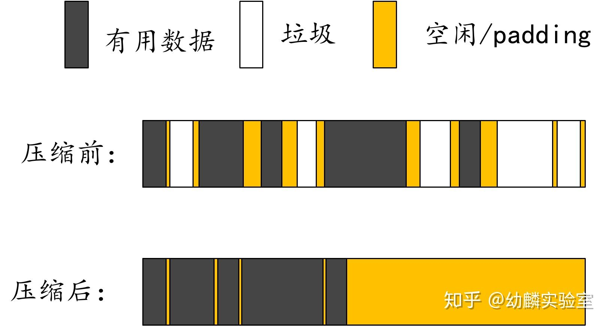
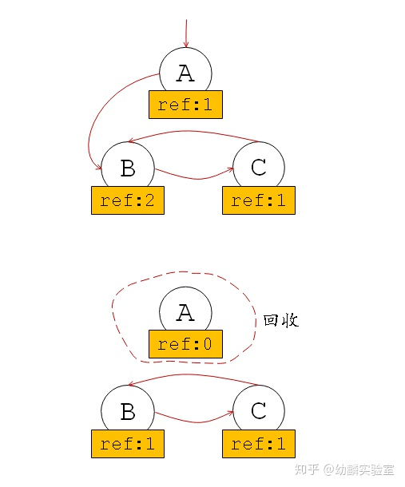

# Go内存管理

## 内存分配

### 基本概念

#### 逃逸分析

## 垃圾回收

### gc算法

原文地址：**https://zhuanlan.zhihu.com/p/338200412?utm_source=ZHShareTargetIDMore&utm_medium=social&utm_oi=710816085917569024**

程序中用的到的数据，一定是从栈、数据段这些地方追踪得到的数据。也就是说可以从这些地方直接追踪到的变量作为根节点，可以追踪到数据范围大于等于真正的有用数据。虽然追踪到不表示后面一定会用到，但是追踪不到就一定不会用到，即是无用的垃圾。所以目前主流的垃圾回收算法，都是使用数据“可达性”近似等价于数据有用性的。

STW（stop the world）

#### 标记-清除

标记的过程需要扫描数据段和栈上的数据，把能够直接追踪到的数据作为root，基于这些root进一步追踪，把能追踪到的数据都进行标记，那剩下的没追踪到的就是垃圾了。

**三色抽象**可以清晰的展现追踪过程中数据标记的变化：

（1）垃圾回收开始会把所有数据都标记为白色；

（2）然后把直接追踪到的root节点都标记为灰色，灰色代表基于当前节点展开的追踪还未完成；

（3）当基于某个节点的追踪任务完成后，便会把该节点标记为黑色，表示它是有用数据，而且无需基于它再次进行追踪了。

（4）当没有灰色节点时，就意味着标记工作可以结束了。此时有用数据都为黑色，垃圾都为白色，在清除阶段回收这些白色的垃圾即可。

标记清除算法实现起来相对简单，但是比较容易造成内存碎片化，而碎片化会影响内存分配与程序执行的效率。

这一问题，可以配合相应的内存管理模型来缓解。例如Tcmalloc内存管理模型这样，把内存块分成不同的规格进行统一管理，可以很好的应对碎片化问题。还有人提出了标记——压缩（整理）算法。

BiBOP（Big back of pages）

**弱三色不变式**

**强三色不变式**

**读写屏障**

写屏障会在写操作中插入指令，目的就是把数据修改通知垃圾回收器，所以写屏障通常都有一个记录集。

#### 标记-压缩（整理）

标记——压缩算法的标记阶段与标记——清除算法相同，不同的是，它会在完成标记工作后对堆内存的使用进行压缩。所谓的压缩，就是移动非垃圾数据，使它们尽可能紧凑的放在内存中。

虽然标记—压缩算法有效解决了内存碎片化的问题，但是带来的多次扫描与移动开销也不容小觑。

标记—压缩算法比较鲜明的特点便是它会移动数据来减少碎片化，还有一种复制式回收算法，也会移动数据。

#### 复制式回收

（1）复制式回收算法会把堆内存划分成两个相等的空间，From和To。程序执行时使用From空间；

（2）垃圾回收执行时会扫描From空间，把能追踪到的数据复制到To空间。

（3）当所有有用的数据都复制到To空间后，把From和To空间的角色交换一下。原来的To空间用作From，原来的From空间则可以全部回收作为新的To空间。

每一轮垃圾回收都是如此，这种复制式回收也不会带来碎片化问题，而且因着使用连续的内存块，可以实现高速的内存分配。但是明显的不足之处就是只有一半的堆内存可以被使用。

为了提高堆内存的使用率，通常会和其它垃圾回收算法搭配使用，只在一部分堆内存中使用复制式回收。例如在分代回收中就经常搭配使用复制式回收。

#### 分代式回收

分代回收的提出，主要是基于弱分代假说（weak generational hypothesis）：

**“**大部分对象都在年轻时死亡**”**

如果我们把新创建的对象称为“新生代对象”，把经受住特定次数的垃圾回收而依然存活的对象称为“老年代对象”。

基于弱分代假说，新生代对象成为垃圾的概率高于老年代对象，所以可以把数据划分为新生代和老年代，降低老年代执行垃圾回收的频率。

对于标记、复制式等追踪类回收算法而言，不用每次都扫描所有数据，将明显提升垃圾回收执行的效率，而且新生代和老年代还可以分别采用不同的回收策略，进一步提升回收效益并减少开销。

分代回收算法大多通过复制式回收来处理新生代对象，只有经历过一定次数的垃圾回收还能依然存活的新生代对象才会被晋升为老年代对象。虽然分代回收算法将回收的注意力主要集中在新生代对象上，但是考虑到老年代到新生代的引用，也依然做不到只扫描新生代就把回收工作完成的地步。

到目前为止我们介绍的多为追踪式回收，都需要在执行垃圾回收时扫描数据识别垃圾对象，而引用计数式垃圾回收有所不同。

#### 引用计数

引用计数指的是一个数据对象被引用的次数，程序执行过程中会更新对象及其子对象的引用计数。当引用计数更新到0时，就表示这个对象不再有用，可以回收它占用的内存了。

所以，引用计数法不用专门执行扫描任务，因为垃圾识别的任务已经分摊到每一次对数据对象的操作中了。

这样说起来简单，但实现起来却并不容易。虽然引用计数法可以及时回收无用内存，但是高频率的更新引用计数也会造成不小的开销。而且还要专门想办法识别循环引用的情况，因为循环引用会导致引用计数无法更新到0，造成对应的内存无法被回收的情况。

