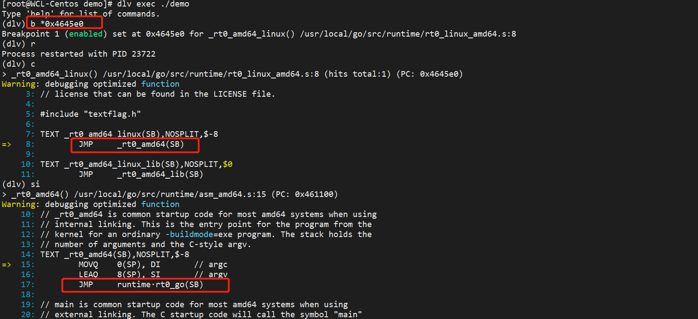
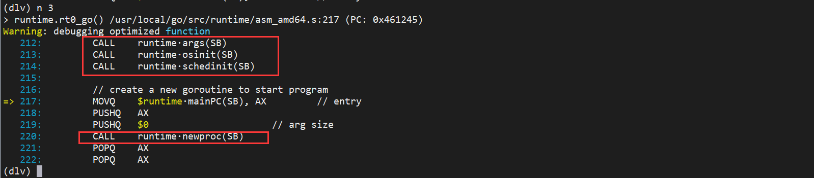

# Go程序是如何启动的

## 理解可执行文件

### 程序构建过程

```bash
$ go build -x go文件	# -x 打印构建详细过程
```

```txt
$ go build -x demo.go
WORK=/tmp/go-build650300936
mkdir -p $WORK/b001/
cat >$WORK/b001/importcfg << 'EOF' # internal
# import config
packagefile fmt=/usr/local/go/pkg/linux_amd64/fmt.a
packagefile runtime=/usr/local/go/pkg/linux_amd64/runtime.a
EOF
cd /root/moychen/demo
-------------------------------编译-----------------------------------
/usr/local/go/pkg/tool/linux_amd64/compile -o $WORK/b001/_pkg_.a -trimpath "$WORK/b001=>" -p main -complete -buildid IHvcy5J3sPf6q7qSX-yU/IHvcy5J3sPf6q7qSX-yU -goversion go1.15.2 -D _/root/moychen/demo -importcfg $WORK/b001/importcfg -pack ./demo.go
/usr/local/go/pkg/tool/linux_amd64/buildid -w $WORK/b001/_pkg_.a # internal
cp $WORK/b001/_pkg_.a /root/.cache/go-build/5d/5d735f650ab1e82b957e556236d1f63ac6f76a8dcd5e347a1f7c98d556a8b37f-d # internal
cat >$WORK/b001/importcfg.link << 'EOF' # internal
packagefile command-line-arguments=$WORK/b001/_pkg_.a
...
packagefile internal/race=/usr/local/go/pkg/linux_amd64/internal/race.a
EOF
mkdir -p $WORK/b001/exe/
cd .
-------------------------------- 链接----------------------------------
/usr/local/go/pkg/tool/linux_amd64/link -o $WORK/b001/exe/a.out -importcfg $WORK/b001/importcfg.link -buildmode=exe -buildid=VljoluUulGgW80qhU4WS/IHvcy5J3sPf6q7qSX-yU/CUJ3YEw9E6g_F0Y_-2iM/VljoluUulGgW80qhU4WS -extld=gcc $WORK/b001/_pkg_.a
/usr/local/go/pkg/tool/linux_amd64/buildid -w $WORK/b001/exe/a.out # internal
mv $WORK/b001/exe/a.out demo
rm -r $WORK/b001/
```

### 可执行文件

可执行文件在不同平台格式规范也不一致。以Linux下ELF（Executable and Linkable Format）为例，详细内容参考[ELF规范参考文档](https://github.com/corkami/pics/blob/28cb0226093ed57b348723bc473cea0162dad366/binary/elf101/elf101.pdf[)，ELF文件主要组成部分有：

> * ELF header
> * Section header
> * Sections


如上图所示，通过ELF header中的 entry point 能够找到 Go 进程的执行入口。Linux下运行可执行文件的步骤大致如下：


## Go进程的启动和初始化

生成二进制可执行文件后，启动时计算机通过执行二进制机器码指令运行程序，每执行一条语句pc寄存器就指向下一条指令。在 64 位平台上 pc 寄存器 = rip。

```go
// demo.go 
package main

import (
	"fmt"
)

func main() {
	fmt.Println("hello world")
}
```

go build 生成可执行文件demo，然后通过readelf -h demo找到可执行文件demo的entry point找到程序入口，使用dlv调试程序。



中间省略一下没有用的信息。



## 调度组件与调度循环

**G（goroutine）**：⼀个计算任务。由需要执⾏的代码和其上下⽂组成，上下⽂包括：当前代码位置、栈顶、栈底地址、状态等。

**M（machine）**：系统线程，执⾏实体，想要在 CPU 上执⾏代码，必须有线程，与 C 语⾔中的线程相同，通过系统调⽤ clone 来创建。

**P（processor）**：虚拟处理器，M 必须获得 P 才能执行代码，否则必须陷⼊休眠（后台监控线程除外），你也可以将其理解为⼀种 token，有这个 token，才有在物理 CPU 核心上执行的权利。

## 处理阻塞

## 调度器的发展历史

## 与调度有关的常见问题

