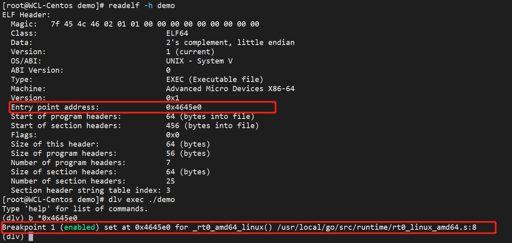

# Go程序是如何启动的

## 理解可执行文件

### 程序构建过程

```bash
$ go build -x go文件	# 观察构建go程序的构建过程
```

```txt
$ go build -x demo.go
WORK=/tmp/go-build650300936
mkdir -p $WORK/b001/
cat >$WORK/b001/importcfg << 'EOF' # internal
# import config
packagefile fmt=/usr/local/go/pkg/linux_amd64/fmt.a
packagefile runtime=/usr/local/go/pkg/linux_amd64/runtime.a
EOF
cd /root/moychen/demo
-------------------------------编译-----------------------------------
/usr/local/go/pkg/tool/linux_amd64/compile -o $WORK/b001/_pkg_.a -trimpath "$WORK/b001=>" -p main -complete -buildid IHvcy5J3sPf6q7qSX-yU/IHvcy5J3sPf6q7qSX-yU -goversion go1.15.2 -D _/root/moychen/demo -importcfg $WORK/b001/importcfg -pack ./demo.go
/usr/local/go/pkg/tool/linux_amd64/buildid -w $WORK/b001/_pkg_.a # internal
cp $WORK/b001/_pkg_.a /root/.cache/go-build/5d/5d735f650ab1e82b957e556236d1f63ac6f76a8dcd5e347a1f7c98d556a8b37f-d # internal
cat >$WORK/b001/importcfg.link << 'EOF' # internal
packagefile command-line-arguments=$WORK/b001/_pkg_.a
...
packagefile internal/race=/usr/local/go/pkg/linux_amd64/internal/race.a
EOF
mkdir -p $WORK/b001/exe/
cd .
-------------------------------- 链接----------------------------------
/usr/local/go/pkg/tool/linux_amd64/link -o $WORK/b001/exe/a.out -importcfg $WORK/b001/importcfg.link -buildmode=exe -buildid=VljoluUulGgW80qhU4WS/IHvcy5J3sPf6q7qSX-yU/CUJ3YEw9E6g_F0Y_-2iM/VljoluUulGgW80qhU4WS -extld=gcc $WORK/b001/_pkg_.a
/usr/local/go/pkg/tool/linux_amd64/buildid -w $WORK/b001/exe/a.out # internal
mv $WORK/b001/exe/a.out demo
rm -r $WORK/b001/
```

### 可执行文件

可执行文件在不同平台格式规范也不一致。以Linux下ELF（Executable and Linkable Format）为例，ELF文件主要组成部分有：

> * ELF header
> * Section header
> * Sections



